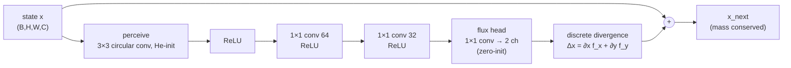
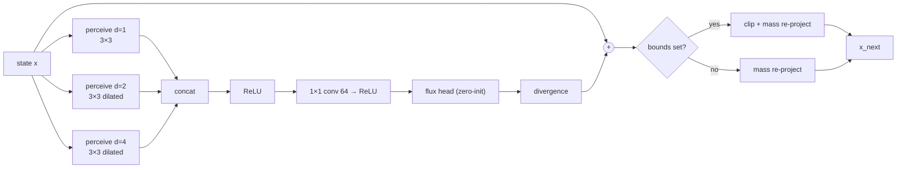
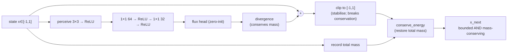
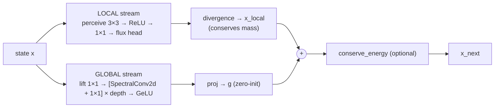
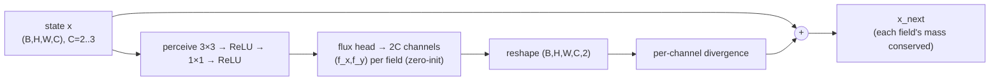
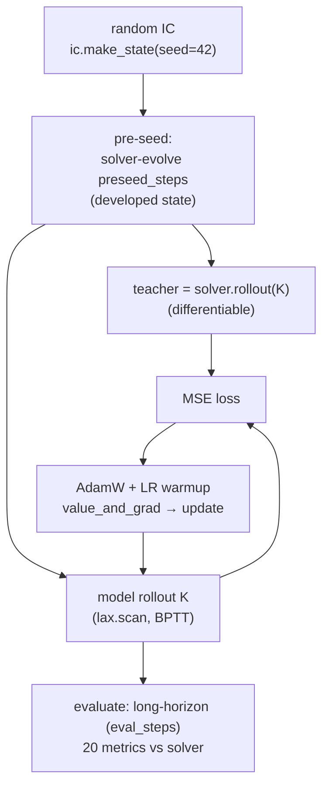

# Architecture Diagrams — Hybrid Models

Data-flow diagrams for every architecture (Mermaid; renders on GitHub). State tensors are
NHWC `(B,H,W,C)`. "1×1 conv" = per-cell MLP; "perceive" = depthwise/learned spatial conv.
All update heads are **zero-initialised** so each model starts as the identity map (a warm start).

## Legend
- **Perceive**: spatial convolution (3×3 circular, optionally dilated/multi-scale) — the only
  non-local op in an NCA; defines the per-step receptive field.
- **Flux head → divergence**: predict a 2-channel flux `(f_x,f_y)` and apply its discrete
  divergence `Δx = (roll(f_x)−f_x)+(roll(f_y)−f_y)` ⇒ **mass conserved by construction**.
- **clip + mass re-project**: `clip(x,lo,hi)` then `conserve_energy` ⇒ bounded **and** conserving.

---

## 1. Conservative PI-NCA (DeepFluxNCA) — the base building block

## 2. MultiScaleFluxNCA — heat winner (dilated multi-scale perception)

*Dilations 1/2/4 widen the receptive field to ±4 cells per step (vs ±1 for a single 3×3),
closing the locality gap cheaply — why it beats FNO on heat at ~1% of the parameters.*

## 3. BoundedConsFluxNCA — Cahn–Hilliard winner (bounded AND conserving)

*Resolves the stability↔conservation tension found in ablation A1: clipping alone fixed
divergence but destroyed conservation; the mass re-projection restores it.*

## 4. SpectralFluxNCA — two-stream (local conservation + global spectral)

*Combines the NCA's local conservation with an FNO-style global spectral term. The global
stream truncates to the lowest Fourier modes (`F⁻¹(R⊙F[v])`) for O(1)-layer global reach.*

## 5. MultiChannelFluxNCA — SWE / FHN / Gray–Scott (per-field conservation)

*Correct prior for periodic conservation laws (shallow-water mass+momentum); a deliberately
wrong prior for source-term reaction systems (FitzHugh–Nagumo) — see the regime map.*

---

## Shared emulator training pipeline (all models)

*Single fixed seed (42), He-init, zero-init heads, LR warmup, and pre-seeding — the
"start from a better point" protocol (`docs/initialization_and_protocol.md`).*
