# Visual Gallery — Analytic vs Model + Error Maps

For each phenomenon: a 3-row montage (top = analytic/solver, middle = trained model,
bottom = |error|) at five timesteps t = 0, T/4, T/2, 3T/4, T (T = 64 steps, grid 32).
Animated GIFs (analytic / model / error) are in `results/gifs/<pde>_{analytic,model,error}.gif`
(generated locally; not committed). Regenerate with `python -m pinca_jax.viz --pde <name>`.

Each model is the regime-appropriate default (`viz.DEFAULT_ARCH`): multi-scale conservative
NCA for local/smooth PDEs, bounded conservative NCA for Cahn–Hilliard, multi-channel
conservative NCA for SWE/Gray–Scott, plain NCA for FitzHugh–Nagumo, FNO for Navier–Stokes.

> Note: these are single-run illustrations at the viz config (grid 32, 120 epochs, 64-step
> rollout) — qualitative, not the multi-seed benchmark numbers in `docs/master_results.md`.

| phenomenon | model shown | final-frame rel-err | montage |
|---|---|---|---|
| Heat | multiscale_flux_nca | 0.022 | 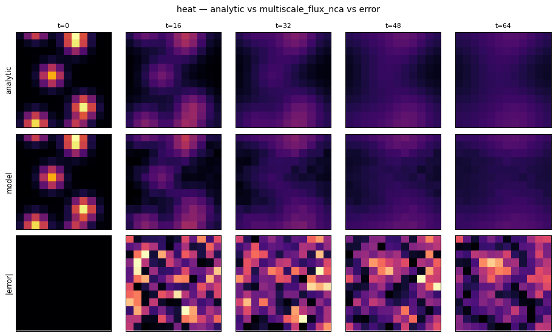 |
| Allen–Cahn | multiscale_flux_nca | 0.027 | 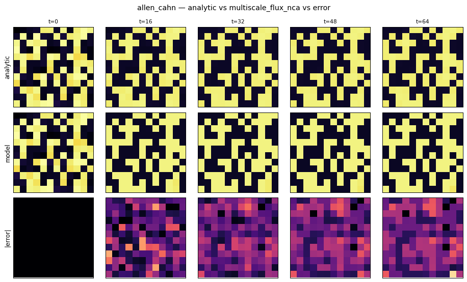 |
| Shallow-water | mc_flux_nca | 0.045 | 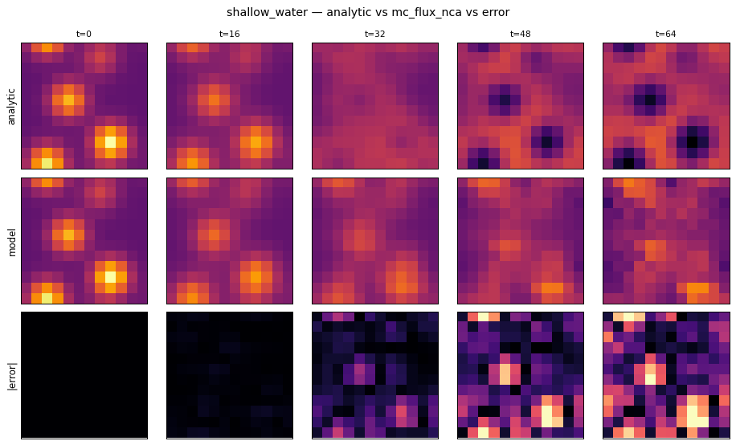 |
| Navier–Stokes | fno | 0.221 | 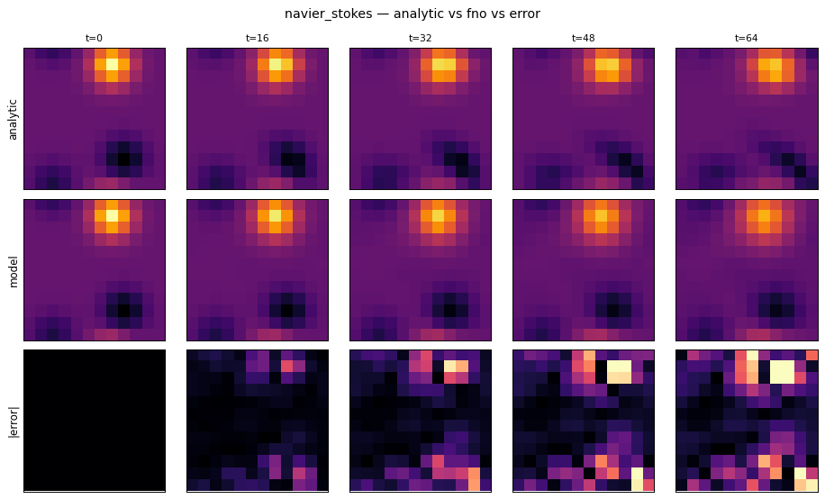 |
| FitzHugh–Nagumo | plain_nca | 0.305 | 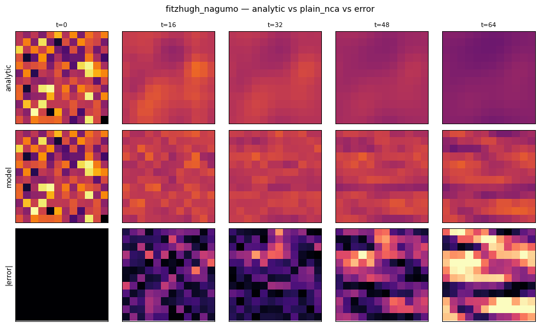 |
| Nagumo | multiscale_flux_nca | 0.465 | 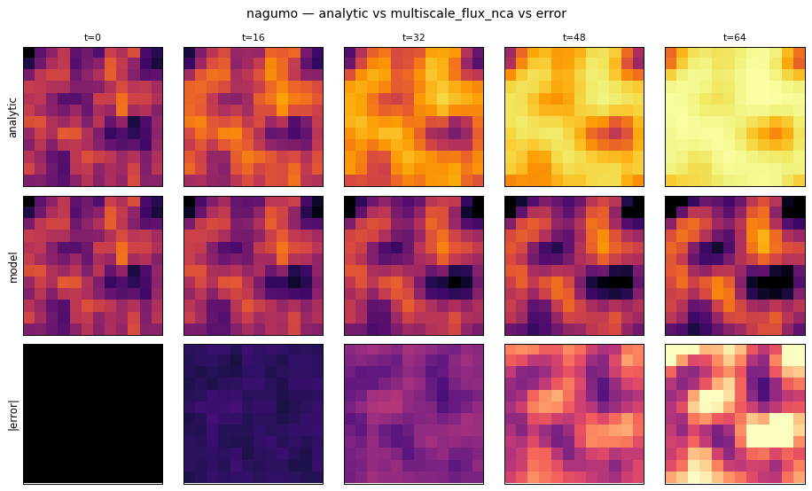 |
| Gray–Scott | mc_flux_nca | 0.498 | 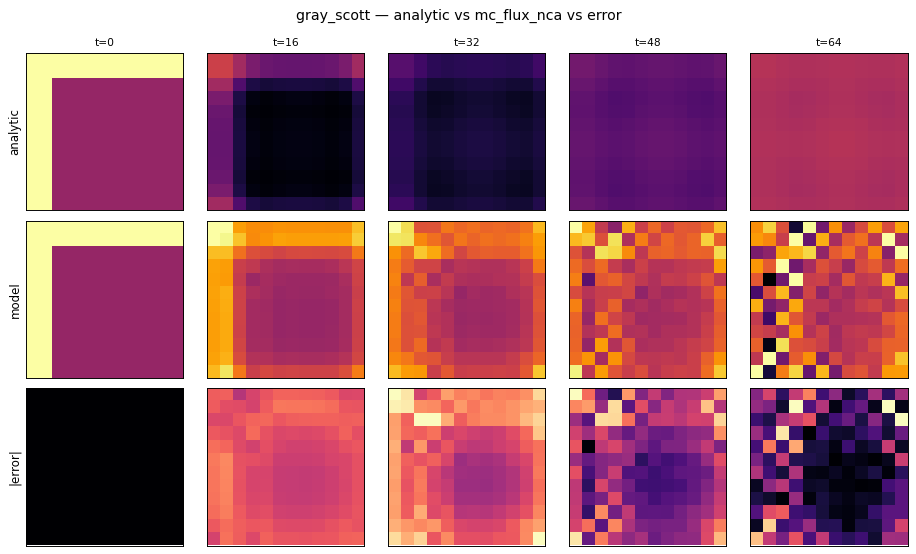 |
| Cahn–Hilliard | bounded_cons_nca | 0.720 | 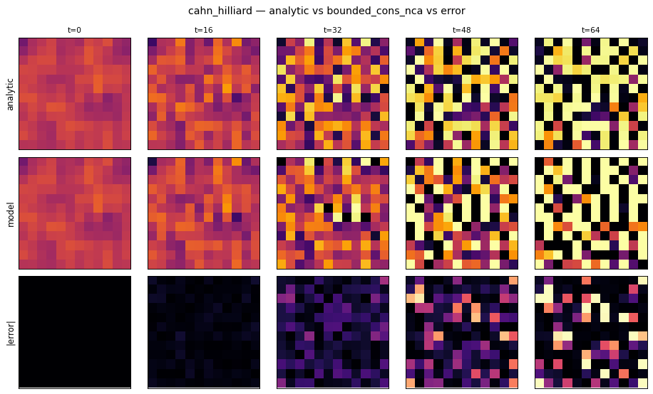 |

**Reading the gallery.** The easy local regimes (heat, Allen–Cahn, shallow-water) show
near-perfect analytic/model agreement with faint structured error. The hard regimes show where
single-run models lag: Cahn–Hilliard (stiff; the 64-step viz horizon exceeds the bounded model's
comfort zone), Gray–Scott/Nagumo (the conserving default fights the non-conservative reaction),
and Navier–Stokes (global coupling — even FNO accumulates visible error over 64 steps). These
match the quantitative regime map in `docs/master_results.md`.

## 3-D gallery (mid-depth z-slice over time)
A 3-D volume can't be a flat GIF, so each 3-D phenomenon is shown as the **mid-depth slice**
(z = D/2) of the analytic vs. model fields plus the error map, over time (`viz3d.py`,
regime-appropriate winner per PDE). Animated 3-D GIFs:
`results/gifs/<pde>_3d_{analytic,model,error}.gif` (local). Committed montages:

| 3-D phenomenon | model shown | montage |
|---|---|---|
| Heat | FluxNCA3D (PI-NCA) | 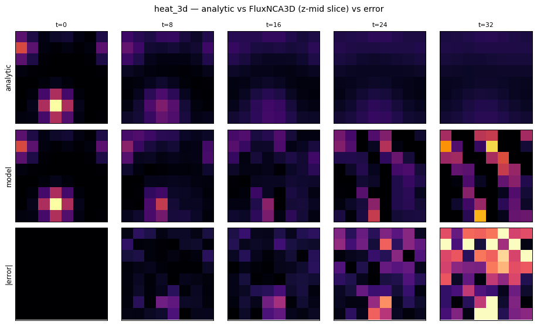 |
| Advection–diffusion | FNO3D | 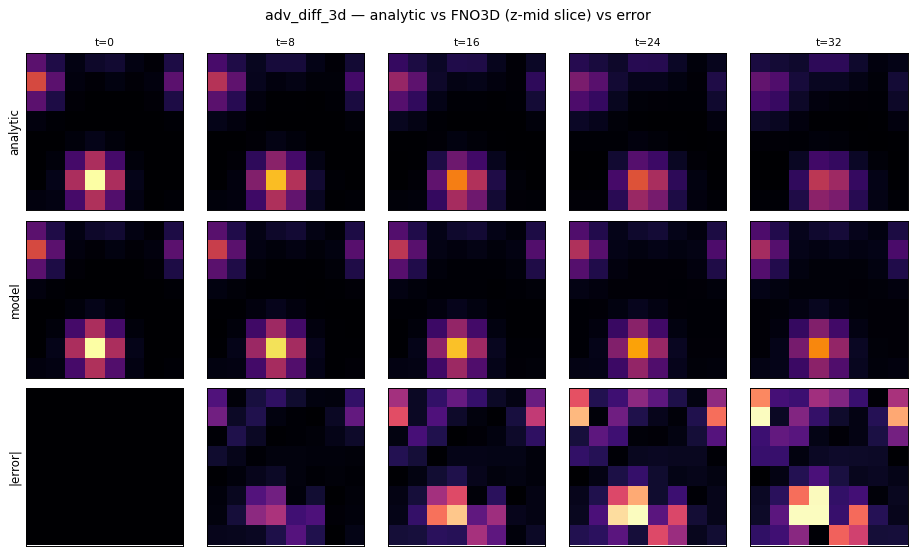 |
| Allen–Cahn | FNO3D | 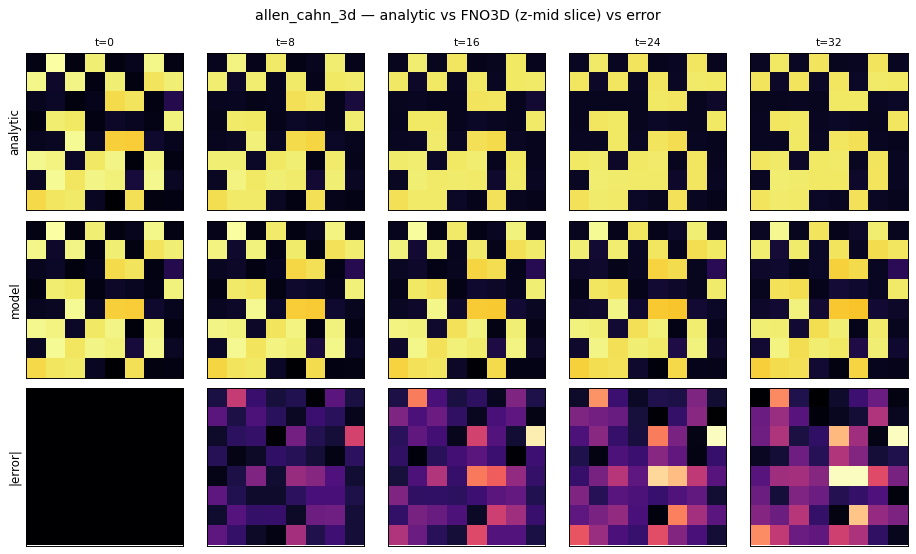 |
| Nagumo | NCA3D | 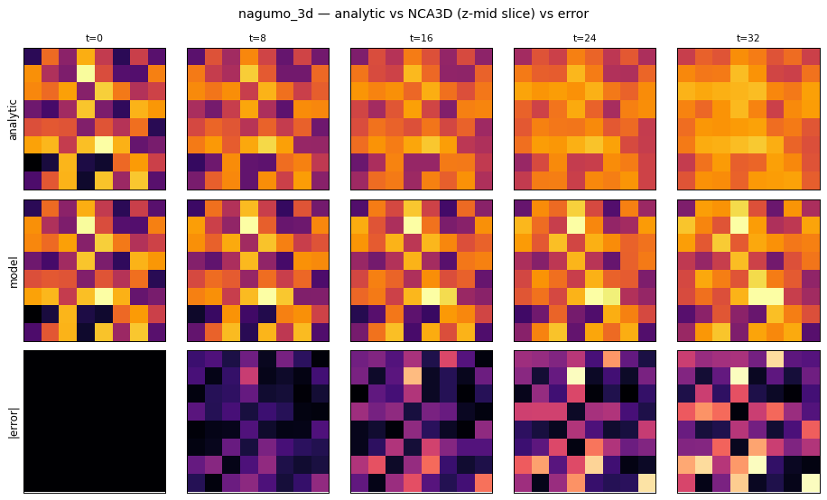 |
| Gray–Scott | NCA3D | 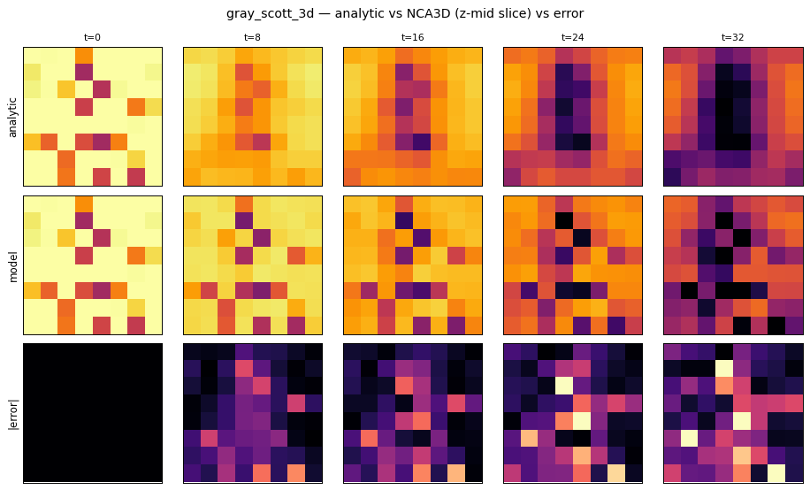 |
| FitzHugh–Nagumo | FNO3D | 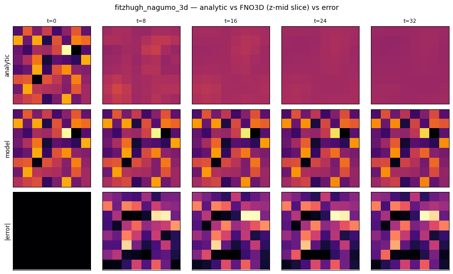 |

These mirror the 2-D gallery and the dimension-independent regime map (`docs/master_results.md §5b`).
