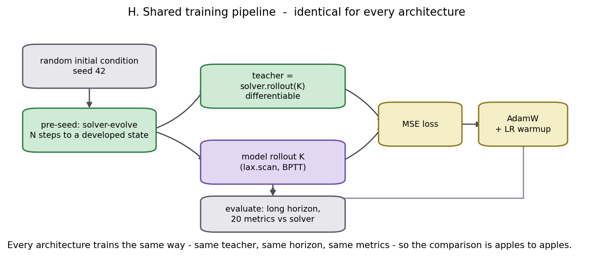
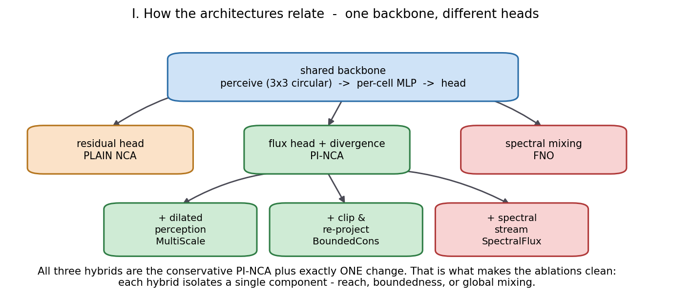
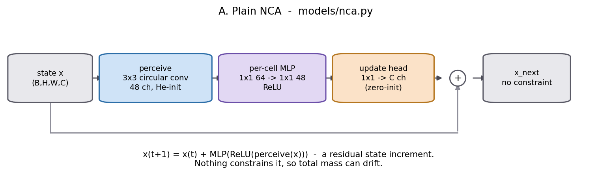
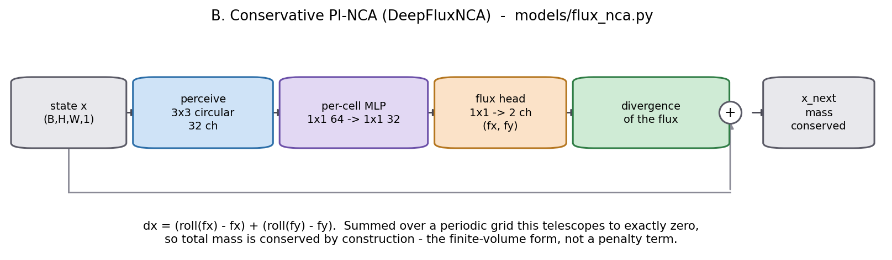
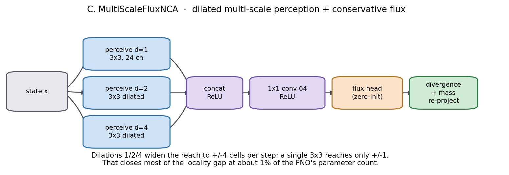
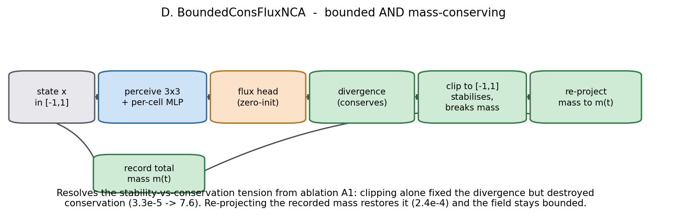
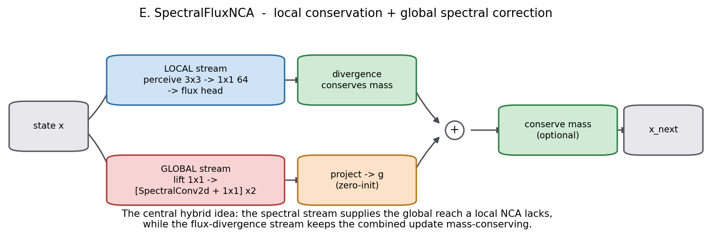
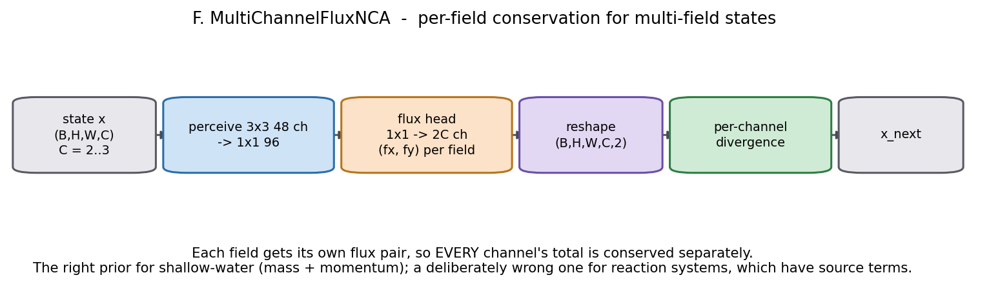
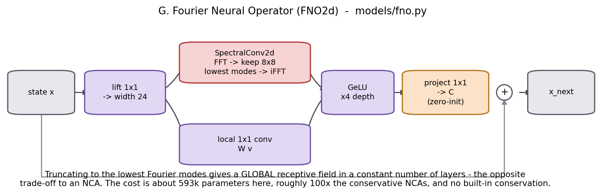

# PI-NCA: Architectures and Results

A guide to every model in this study — what it is, how it works, and how it performed.
Branch: `research/jax-migration`. Code: `src/pinca_jax/`.

All numbers here come from the committed benchmark files in `results/`. They were produced
on a CPU host at reduced scale (small grids, short training), so treat the **ordering** as
the finding and the exact digits as provisional.

---

## 1. The setup in one page

Every model in this study does the **same job**: look at the current state of a physical
field, and predict what it looks like one time step later.

```
model:  state at time t   ->   state at time t+1
```

Apply it over and over and you get a simulation. This is called an **autoregressive
emulator**.

To train it we use a **teacher**: a normal, hand-written PDE solver (`equations/pdes.py`).
The teacher is correct but slow. We roll the teacher forward K steps, roll the model
forward K steps from the same starting point, and train the model to match. This is
distillation.

Because every architecture is trained against the same teacher, from the same starting
conditions, over the same horizon, and scored with the same metrics, the comparison is
fair. That shared pipeline is the whole reason the results mean anything.



*Figure H — `docs/figures/arch/arch_training_pipeline.png`*

Three details in that pipeline matter:

- **Pre-seeding.** Random initial conditions are unrealistically smooth. We run the solver
  forward a few steps first, so the model trains on *developed* patterns, not just blobs.
- **Zero-initialised output head.** Every model starts as the identity map — it initially
  predicts "nothing changes". Training then only has to learn the *change*. This is a much
  easier starting point than random output.
- **Training through the rollout (BPTT).** The loss is computed after K steps, not one, so
  the model sees its own accumulated error during training. Ablation A6 shows this is
  decisive for unstable problems.

### The physics problems (PDEs)

Ten in 2-D, six in 3-D. What matters for reading the results is which **structure** each one
has, because that is what selects the winning architecture:

| Property | Meaning | PDEs with it |
|---|---|---|
| Conservative | Total mass stays constant | heat, advection–diffusion, shallow-water, Cahn–Hilliard |
| Non-conservative | Source terms create/destroy quantity | Nagumo, FitzHugh–Nagumo, Allen–Cahn, Gray–Scott |
| Bounded | Field is physically stuck in a range | Cahn–Hilliard, Allen–Cahn (in [-1, 1]) |
| Globally coupled | One point instantly affects all others | Navier–Stokes (pressure/Poisson) |
| Multi-field | Several quantities interact | shallow-water (3), wave / Gray–Scott / FHN (2) |

---

## 2. What is a Neural Cellular Automaton?

A cellular automaton is a grid of cells where each cell updates itself using only what it
can see in its immediate neighbourhood, with **the same rule everywhere**. Conway's Game of
Life is the famous example.

A **Neural Cellular Automaton (NCA)** replaces the hand-written rule with a small neural
network. Each cell:

1. **Perceives** — a 3×3 convolution gathers the cell's own value and its 8 neighbours.
2. **Processes** — a tiny per-cell MLP (built from 1×1 convolutions) decides what to do.
3. **Updates** — the cell adds a small increment to itself.

The same network is applied to every cell simultaneously, and the whole thing repeats.

Three properties follow directly from that design, and they explain almost everything in the
results:

- **It is local.** One step moves information exactly one cell. To cross a 24-cell grid takes
  24 steps. This is a good match for diffusion, and a bad match for anything with global
  coupling.
- **It is translation-equivariant and size-agnostic.** The same weights apply at every
  position, and to any grid size. A model trained at 16×16 can be run at 48×48.
- **It is tiny.** A few thousand parameters, because the network is shared across all cells
  rather than being a function of the whole grid.

The convolution uses **circular padding**, so the left edge wraps to the right and the top to
the bottom. Periodic boundary conditions come for free — no boundary loss term needed.

### Why "physics-informed"?

A plain NCA can output any increment it likes. Nothing stops the total amount of stuff in
the grid from drifting up or down, which for a conservation law is simply wrong.

The physics-informed version fixes this **structurally**, not with a penalty term. Instead
of predicting the change directly, it predicts a **flux** — how much material flows between
neighbouring cells — and the change is computed as the divergence of that flux. Whatever
leaves one cell arrives in another. Summed over a periodic grid the total change is exactly
zero, by arithmetic, no matter what the network outputs.

This is the key idea of the whole project: **build the physical law into the shape of the
update, so it cannot be violated.**

---

## 3. The architecture family

Everything here is one shared backbone with a different ending. That is deliberate: it means
a difference in results can be attributed to one component.



*Figure I — `docs/figures/arch/arch_family_tree.png`*

{{ARCH_TABLE}}

---

## 4. The architectures, one by one

### A. Plain NCA — `models/nca.py`

The unconstrained baseline. Perceive, process, add the result to the state.



*Figure A — `docs/figures/arch/arch_plain_nca.png`*

```
x_next = x + MLP(ReLU(perceive(x)))
```

**Strengths.** Cheap, simple, and completely unopinionated — it can represent any local
update, including ones that create or destroy material. That freedom is exactly what makes
it the best model on reaction problems.

**Weaknesses.** No conservation. On the heat equation its mass drifts by **33** while the
flux version drifts by **0.0004**. Error also accumulates badly over long rollouts.

**Best at:** FitzHugh–Nagumo, Nagumo, wave — all non-conservative.

---

### B. Conservative PI-NCA (DeepFluxNCA) — `models/flux_nca.py`

The core contribution. Same backbone, but the head outputs a two-channel flux field
`(fx, fy)`, and the state update is the discrete divergence of that flux.



*Figure B — `docs/figures/arch/arch_pi_nca.png`*

```
dx = (roll(fx) - fx) + (roll(fy) - fy)
x_next = x + dx
```

Every term appears twice with opposite signs when you sum over a periodic grid, so the
total cancels exactly. Mass is conserved to floating-point precision regardless of what the
network learned. This is the finite-volume form used by classical conservative solvers.

**Strengths.** Exact conservation, and it is the *smallest* model in the study (4 576
parameters).

**Weaknesses.** Still strictly local. And conservation is a *prior* — when the real physics
has source terms, enforcing it actively hurts (see ablation A4).

**Best at:** 3-D heat. Strong on advection–diffusion.

---

### C. MultiScaleFluxNCA — `models/hybrids.py` *(hybrid)*

**The problem it solves:** an NCA moves information one cell per step, which is too slow
when the physics couples distant points.

**The fix:** perceive at three dilations at once — 1, 2 and 4 — and concatenate. The model
now reaches ±4 cells per step instead of ±1, without an FFT and without many more weights.



*Figure C — `docs/figures/arch/arch_multiscale_flux_nca.png`*

**Why it should help.** Diffusive problems need information to travel; a one-cell-per-step
model needs as many steps as the grid is wide. Dilation buys reach for almost no parameters,
which is the cheapest place to spend them.

Ablation A5 (§6.3) isolates this, and shows that *how* you widen matters: on the globally
coupled Navier–Stokes a plain 5×5 stencil actually destabilises the model, while dilated
multi-scale does not. Reach helps; reach the wrong way hurts.

Measured results: §6.2 and §5.

---

### D. BoundedConsFluxNCA — `models/hybrids.py` *(hybrid)*

**The problem it solves.** On Cahn–Hilliard — a stiff equation whose field is physically
stuck in [-1, 1] — every emulator blew up, reaching rel-L2 of 13–18 when simply predicting
"nothing changes" would have scored 0.93.

Ablation A1 diagnosed it: unbounded network outputs drift outside the physical range and
then explode. Clipping each step to [-1, 1] fixed the blow-up — a **24–27× improvement** —
but *destroyed* conservation, because clipping arbitrarily adds and removes material
(3.3e-5 → 7.6).

So stability and conservation were in direct conflict.

**The fix.** Record the total mass before the update. Do the conservative flux update. Clip.
Then re-project the total mass back to the recorded value. Bounded *and* conserving.



*Figure D — `docs/figures/arch/arch_bounded_cons_nca.png`*

**Why it should help.** It is the only model in the study that has both properties at once.
Everything else is bounded *or* conserving.

The bounds are not hardcoded: each model is given the PDE's **measured physical range**,
taken from a short solver rollout. Clipping to a fixed [-1, 1] is right for Cahn–Hilliard but
would destroy heat, whose amplitudes run 5–10 — which is exactly why this model used to be
benchmarked on one phenomenon instead of all ten.

Measured results: §6.2 and §5.

---

### E. SpectralFluxNCA — `models/hybrids.py` *(hybrid)*

**The idea.** The central hypothesis of the project: take the FNO's global reach and the
NCA's local conservation, and run them as two parallel streams.

- **Local stream:** perceive → MLP → flux head → divergence. Conserves mass.
- **Global stream:** lift → two spectral convolution layers → project. Sees everything at once.

The two are added, and the sum is optionally mass-projected.



*Figure E — `docs/figures/arch/arch_spectral_flux_nca.png`*

**What to watch for.** This is the most ambitious hybrid and the most expensive: the
spectral stream dominates its parameter count, putting it two orders of magnitude above the
other NCAs. Two questions decide whether that is worth it, and §5 answers both from the
measurements: does it beat the far cheaper dilated perception, and is it *stable across
seeds*? A model whose standard deviation approaches its mean has not really won anything.

It has no bounding mechanism, so it is expected to struggle wherever the field is stiff and
bounded.

---

### F. MultiChannelFluxNCA — `models/flux_nca.py`

For states with several interacting fields — shallow-water has 3 (height and two momenta),
Gray–Scott and FitzHugh–Nagumo have 2. The head outputs `2C` channels: a separate flux pair
per field, so **each field's total is conserved independently.**



*Figure F — `docs/figures/arch/arch_mc_flux_nca.png`*

**The sharpest illustration of the whole thesis.** Compare its two columns in §6.2:
shallow-water, where per-field conservation is physically correct, against FitzHugh–Nagumo,
which has source terms and conserves nothing. On the second it conserves mass beautifully and
predicts badly — it is enforcing a law the physics does not obey.

**Conserving the wrong thing perfectly is worse than not conserving at all.**

---

### G. Fourier Neural Operator (FNO) — `models/fno.py`

Not an NCA. The main competitor, and the standard method in the field.

Instead of looking at neighbours, it transforms the whole field to the frequency domain with
an FFT, keeps only the lowest 8×8 frequency modes, multiplies them by learned weights, and
transforms back. Every output point depends on every input point — **global reach in one
layer.**



*Figure G — `docs/figures/arch/arch_fno.png`*

```
v_next = GeLU( W·v + iFFT( R ⊙ FFT(v) ) )
```

**Strengths.** Global coupling immediately, so it dominates Navier–Stokes. Keeping the whole
spectrum means it also resolves sharp interfaces well — on heat its high-frequency error
fraction is **0.004** versus the NCAs' 0.44–0.89.

**Weaknesses.** 592 897 parameters — roughly 100× the conservative NCAs. No conservation at
all (heat mass drift: 21.3). Assumes a periodic regular grid.

`fno_small` is in the matrix for exactly one reason: to separate architecture from budget.
It is the same operator shrunk to roughly NCA parameter count, so the gap between `fno` and
`fno_small` measures how much of the FNO's advantage is simply *size*. See §6.2.

---

### H. The continuous baselines — PINN and DeepONet

These solve a genuinely different problem, so they are reported separately, not as head-to-head
competitors.

**PINN** (`pinn_heat.py`) learns one continuous function `u(x, t)` for **one** initial
condition, trained purely on the PDE residual with no data. Mesh-free and elegant, but it must
be retrained from scratch for every new initial condition, and it struggles with high
frequencies.

**DeepONet** (`deeponet_heat.py`) learns an *operator* — a mapping from an initial condition
to the solution — so unlike a PINN it generalises across initial conditions.

| Model | rel-L2 @ T | Params | Train time | Paradigm |
|---|---|---|---|---|
| **DeepONet** | **0.075 ± 0.009** | 126 593 | ~9 s | operator, works across ICs |
| PINN | 0.208 ± 0.018 | 14 209 | ~88 s | single problem, no training data |

---

## 5. Hybrid results

{{HYBRID_RESULTS}}

---

## 6. Comprehensive results

Every table in this section is **generated from `results/*.json`** by
`python -m pinca_jax.report`, so the document cannot quote a different set of
architectures from the one the benchmarks actually ran. A dash means that cell has not
been measured yet; re-run `bash run_gpu.sh` and regenerate to fill it in.

{{RUN_INFO}}

### 6.1 The regime map — which architecture wins where

{{REGIME_MAP}}

*Figure: `docs/figures/bench/bench_regime_map.png`*

### 6.2 The full 2-D matrix

Every architecture on every phenomenon, same list throughout.

{{MATRIX_2D}}

Full 20-metric tables per phenomenon: `results/bench_<pde>_full.md`.

### 6.3 Ablations — which component actually matters

{{ABLATIONS}}

*Figures: `docs/figures/bench/bench_ablation_A4.png`, `bench_ablation_A5.png`*

### 6.4 Efficiency — what accuracy costs

{{EFFICIENCY}}

*Figure: `docs/figures/bench/bench_accuracy_vs_cost.png`*

### 6.5 The full 3-D matrix

{{MATRIX_3D}}

*Figure: `docs/figures/bench/bench_accuracy_3d.png`*

### 6.6 Resolution transfer

{{RESOLUTION}}

*Figures: `docs/figures/bench/bench_resolution_*.png`*

---

## 7. What to take away

1. **No universal winner.** Architecture should be chosen from the PDE's structure —
   conservation, boundedness, and how far information travels per step.
2. **Structural constraints beat penalty terms.** Flux-divergence conserves mass to 1e-4 or
   better *by construction*. A loss term only encourages it.
3. **The right prior is worth ~100× the parameters.** On heat, 5 520 parameters beat 592 897.
4. **The wrong prior is worse than none.** Per-field conservation on FitzHugh–Nagumo conserves
   to 1e-6 and produces a useless model (0.993).
5. **Conservation is not stability.** On Cahn–Hilliard, models conserved mass perfectly while
   diverging to rel-L2 24. Bounding was the missing ingredient.
6. **Hybrids work when they target a specific measured failure.** MultiScale and BoundedCons
   each fixed a diagnosed problem and won their regime. SpectralFlux was the most ambitious
   and delivered least reliably. Stacking two winners (bounded + multi-scale) made things
   slightly *worse*.

---

## 8. Figure index

All paths relative to the repository root.

### Architecture diagrams — `docs/figures/arch/`

| File | Shows |
|---|---|
| `arch_family_tree.png` | How all architectures relate to one backbone |
| `arch_plain_nca.png` | Plain NCA |
| `arch_pi_nca.png` | Conservative PI-NCA (flux divergence) |
| `arch_multiscale_flux_nca.png` | MultiScaleFluxNCA hybrid |
| `arch_bounded_cons_nca.png` | BoundedConsFluxNCA hybrid |
| `arch_spectral_flux_nca.png` | SpectralFluxNCA hybrid |
| `arch_mc_flux_nca.png` | MultiChannelFluxNCA |
| `arch_fno.png` | Fourier Neural Operator |
| `arch_training_pipeline.png` | Shared training pipeline |

Regenerate with `python -m pinca_jax.arch_figs`.

### Benchmark plots — `docs/figures/bench/`

| File | Shows |
|---|---|
| `bench_regime_map.png` | Which architecture wins which PDE |
| `bench_accuracy_2d.png` | rel-L2, all models, all 2-D phenomena |
| `bench_accuracy_3d.png` | The 3-D suite |
| `bench_conservation_2d.png` | Mass drift — where the flux head earns its keep |
| `bench_accuracy_vs_cost.png` | Accuracy vs parameter count |
| `bench_error_growth.png` | Error growth from T/4 to T |
| `bench_psnr_2d.png` | PSNR |
| `bench_train_time.png`, `bench_throughput.png` | Training cost, inference speed |
| `bench_ablation_A4.png`, `bench_ablation_A5.png` | Conservation on/off; perception size |
| `bench_resolution_*.png` | Train-grid × eval-grid transfer |

Regenerate with `python -m pinca_jax.plots`.

### Simulation figures — `docs/figures/`

| File pattern | Shows |
|---|---|
| `<pde>_comparison.png` | Analytic vs model vs error, 2-D, at key timesteps |
| `<pde>_3d_comparison.png` | Same in 3-D, mid-depth slice |
| `<pde>_3d_volume.png` | True 3-D volume render |

For `<pde>` in: heat, allen_cahn, nagumo, adv_diff, gray_scott, shallow_water,
fitzhugh_nagumo, wave, cahn_hilliard, navier_stokes (2-D); heat, adv_diff, allen_cahn,
nagumo, gray_scott, fitzhugh_nagumo (3-D).

---

## 9. Source files

| Component | Path |
|---|---|
| Plain NCA | `src/pinca_jax/models/nca.py` |
| Conservative PI-NCA, multi-channel | `src/pinca_jax/models/flux_nca.py` |
| All three hybrids | `src/pinca_jax/models/hybrids.py` |
| FNO | `src/pinca_jax/models/fno.py` |
| Ablation backbone | `src/pinca_jax/models/ablation_nca.py` |
| Conservation operators | `src/pinca_jax/physics.py` |
| PDE solvers (teachers) | `src/pinca_jax/equations/pdes.py` |
| Training / evaluation harness | `src/pinca_jax/harness.py` |
| 3-D counterparts | `src/pinca_jax/*3d.py` |
| Benchmark drivers | `src/pinca_jax/bench.py`, `bench_all.py`, `bench3d.py` |
| Correctness gate | `tests/` (56 tests) |

Reproduce: `python -m pytest tests/ -q`, then `bash run_gpu.sh` (see `docs/gpu_runbook.md`).
